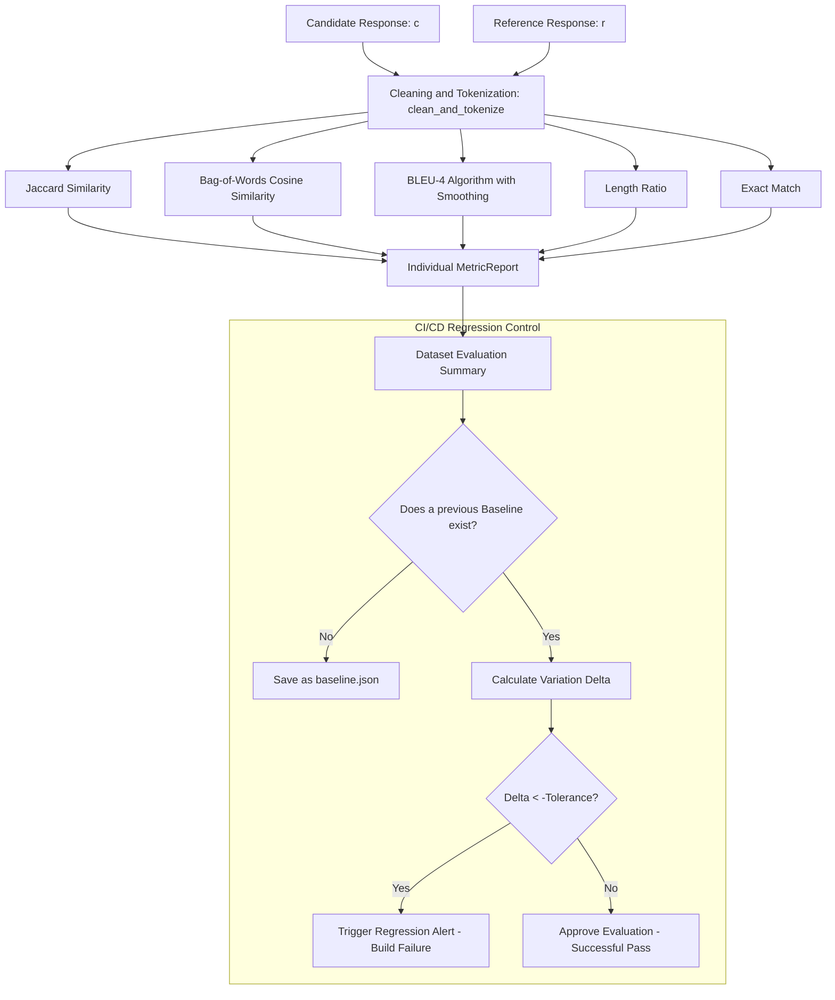

# LLM Eval Harness

Automated response quality evaluation harness for language models (LLMs), designed to audit performance, establish accuracy baselines, and alert on behavioral regressions in continuous integration MLOps flows.

The module implements lexical text comparison metrics and n-gram overlap algorithms natively in Python, eliminating external network or storage dependencies and ensuring portable local execution.

## Evaluator Architecture and Quality Metrics

The evaluation harness operates by contrasting the output generated by a model (candidate) against a golden reference dataset (ground-truth).



### 1. Quality Metric Specifications

The `LLMEvaluator` module synchronously computes five mathematical metrics to evaluate response fidelity:

*   **Exact Match (EM):** Checks exact binary equality between the candidate $c$ and the reference $r$ after stripping leading/trailing whitespace and normalizing internal spaces:
    $$\text{EM}(c, r) = \mathbb{I}(\text{strip}(c) == \text{strip}(r))$$
*   **Jaccard Similarity:** Calculates the overlap at the unique token set level between the candidate $C_t$ and the reference $R_t$:
    $$J(C_t, R_t) = \frac{|C_t \cap R_t|}{|C_t \cup R_t|}$$
*   **Bag-of-Words Cosine Similarity:** Models both texts as frequency vectors in the common vocabulary space $V = C_t \cup R_t$:
    $$\text{Cosine}(c, r) = \frac{\mathbf{v}_c \cdot \mathbf{v}_r}{\|\mathbf{v}_c\|_2 \|\mathbf{v}_r\|_2} = \frac{\sum_{w \in V} f_c(w) f_r(w)}{\sqrt{\sum_{w \in V} f_c(w)^2} \sqrt{\sum_{w \in V} f_r(w)^2}}$$
    Where $f_c(w)$ and $f_r(w)$ are the absolute frequencies of term $w$ in the candidate and reference respectively.
*   **BLEU-4 Score (Bilingual Evaluation Understudy):** Evaluates joint n-gram precision for $n \in \{1, 2, 3, 4\}$.
    1.  *Clipped Precision ($p_n$):* Counts n-gram matches, capping the hit count at the maximum n-gram frequency observed in the reference to prevent false positives from fraudulently repeated words:
        $$p_n = \frac{\sum_{ng \in C_n} \text{Count}_{\text{clip}}(ng)}{\sum_{ng \in C_n} \text{Count}(ng)}$$
    2.  *Brevity Penalty (BP):* Penalizes responses that are excessively short compared to the reference:
        $$\text{BP} = \begin{cases} 1 & \text{if } c > r \\ e^{1 - r/c} & \text{if } c \le r \end{cases}$$
    3.  *Smoothing:* If a higher-order n-gram ($n=3$ or $n=4$) lacks exact matches, Laplace smoothing is applied by assigning $p_n = \frac{0.1}{|C_n|}$ instead of absolute zero, in order to allow evaluation of short sentences.
    4.  *Final BLEU Score:*
        $$\text{BLEU-4} = \text{BP} \cdot \exp\left( \sum_{n=1}^{4} w_n \ln p_n \right)$$
        Where $w_n = 0.25$ is the uniform weight distribution.
*   **Length Coherence Ratio:** Measures the word-count proportion to audit verbose hallucinations or truncated responses:
    $$\text{Length Ratio} = \frac{\text{len}(c)}{\text{len}(r)}$$

### 2. Regression Detection in MLOps Pipelines

The harness acts as an automatable Quality Gate:
*   **Baseline:** Allows exporting the average evaluation results to a local JSON file, configuring it as the certified stable behavior signature.
*   **Deviation Comparison (Delta):** In subsequent runs, the system calculates the relative difference of each averaged metric:
    $$\Delta M = \frac{M_{\text{experimental}} - M_{\text{baseline}}}{M_{\text{baseline}}}$$
*   **Regression Alert:** If $\Delta M$ is below the configured negative tolerance threshold (for example, $-0.05$, representing a 5% loss in model quality), the harness reports a safety alarm that can be configured to abort the model's integration or deployment on the CI/CD branch.

## Connection to the Ecosystem

This component validates the results of:
1.  **llm-qlora-finetuner:** Evaluates whether applying LoRA adapters and NF4 inference causes semantic degradation in the quantized model's generation compared to the dataset's original golden texts.
2.  **llm-inference-server / orchestra-agents:** Allows auditing that the responses emitted by the server's inference threads or the autonomous agents' conclusions remain aligned with historical quality metrics.

## Project Structure

*   `evaluator.py`: Contains the definitions of the Pydantic-based `MetricReport` and `DatasetEvaluationSummary` classes, as well as the `LLMEvaluator` class with the normalization and mathematical calculation methods.
*   `test_eval.py`: Unit test suite that checks the accuracy of the Jaccard, cosine, and BLEU-4 formulas against edge cases and the correct interception of regression alarms.
*   `example.py`: Interactive code that simulates the evaluation of a base model, the export of its JSON baseline, the subsequent evaluation of an experimentally degraded model, and the breakdown of alerts in the console.

## Installation and Execution

### 1. Activate Local Environment and Install Dependencies

Since all mathematical formulas are implemented natively in Python using basic NumPy, no GPU hardware is required:

```bash
python3 -m venv .venv
source .venv/bin/activate
pip install -r requirements.txt
```

### 2. Run Automated Tests

Check the correct functioning of the text comparison algorithms and the regression alert logic:

```bash
.venv/bin/python -m unittest test_eval.py
```

### 3. Run MLOps Evaluation Demo

```bash
.venv/bin/python example.py
```

The script will simulate a complete MLOps cycle: it will establish a baseline, evaluate an alternative candidate model, and display in detail the degradation alerts, calculating the exact deviation percentage.
