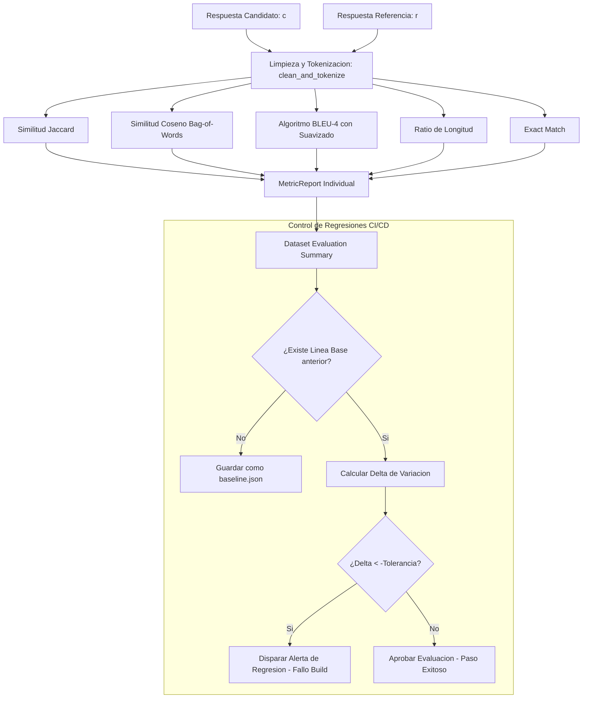

# LLM Eval Harness

Arnes de evaluacion automatizada de calidad de respuesta para modelos de lenguaje (LLMs), disenado para auditar rendimientos, establecer lineas base (baselines) de precision y alertar de regresiones de comportamiento en flujos de integracion continua de MLOps.

El modulo implementa metricas lexicas de comparacion textual y algoritmos de solapamiento de n-gramas de forma nativa en Python, eliminando dependencias externas de red o almacenamiento y asegurando su ejecucion portable en local.

## Arquitectura del Evaluador y Metricas de Calidad

El harness de evaluacion opera contrastando la salida generada por un modelo (candidato) frente a un dataset de referencia dorada (ground-truth).



### 1. Especificaciones de las Metricas de Calidad

El modulo `LLMEvaluator` calcula de forma sincrona cinco metricas matematicas para evaluar la fidelidad de la respuesta:

*   **Exact Match (EM):** Verifica la igualdad binaria exacta entre el candidato $c$ y la referencia $r$ tras eliminar espacios en blanco iniciales y finales y normalizar espacios internos:
    $$\text{EM}(c, r) = \mathbb{I}(\text{strip}(c) == \text{strip}(r))$$
*   **Similitud Jaccard:** Calcula el solapamiento a nivel de conjunto de tokens unicos entre el candidato $C_t$ y la referencia $R_t$:
    $$J(C_t, R_t) = \frac{|C_t \cap R_t|}{|C_t \cup R_t|}$$
*   **Similitud de Coseno de Bolsa de Palabras (Bag of Words):** Modela ambos textos como vectores de frecuencias en el espacio del vocabulario comun $V = C_t \cup R_t$:
    $$\text{Cosine}(c, r) = \frac{\mathbf{v}_c \cdot \mathbf{v}_r}{\|\mathbf{v}_c\|_2 \|\mathbf{v}_r\|_2} = \frac{\sum_{w \in V} f_c(w) f_r(w)}{\sqrt{\sum_{w \in V} f_c(w)^2} \sqrt{\sum_{w \in V} f_r(w)^2}}$$
    Donde $f_c(w)$ y $f_r(w)$ son las frecuencias absolutas del termino $w$ en el candidato y la referencia respectivamente.
*   **BLEU-4 Score (Bilingual Evaluation Understudy):** Evalua la precision de n-gramas conjuntos para $n \in \{1, 2, 3, 4\}$.
    1.  *Precision Recortada ($p_n$):* Cuenta las coincidencias de n-gramas limitando la frecuencia de aciertos a la frecuencia maxima del n-grama observada en la referencia para evitar falsos positivos por palabras repetidas de forma fraudulenta:
        $$p_n = \frac{\sum_{ng \in C_n} \text{Count}_{\text{clip}}(ng)}{\sum_{ng \in C_n} \text{Count}(ng)}$$
    2.  *Brevity Penalty (BP):* Penaliza respuestas excesivamente cortas frente a la referencia:
        $$\text{BP} = \begin{cases} 1 & \text{si } c > r \\ e^{1 - r/c} & \text{si } c \le r \end{cases}$$
    3.  *Suavizado (Smoothing):* Si un n-grama superior ($n=3$ o $n=4$) carece de coincidencias exactas, se aplica un suavizado de Laplace asignando $p_n = \frac{0.1}{|C_n|}$ en lugar de cero absoluto para permitir la evaluacion de oraciones cortas.
    4.  *BLEU Score Final:*
        $$\text{BLEU-4} = \text{BP} \cdot \exp\left( \sum_{n=1}^{4} w_n \ln p_n \right)$$
        Donde $w_n = 0.25$ es la distribucion uniforme de pesos.
*   **Ratio de Coherencia de Longitud:** Mide la proporcion en cantidad de palabras para auditar alucinaciones verborreicas o respuestas truncadas:
    $$\text{Length Ratio} = \frac{\text{len}(c)}{\text{len}(r)}$$

### 2. Deteccion de Regresiones en pipelines de MLOps

El harness actua como una barrera de control de calidad (Quality Gate) automatizable:
*   **Linea Base (Baseline):** Permite exportar los resultados promedios de la evaluacion en un archivo JSON local configurandolo como la firma de comportamiento estable certificada.
*   **Comparativa de Desviacion (Delta):** En ejecuciones subsecuentes, el sistema calcula la diferencia relativa de cada metrica promediada:
    $$\Delta M = \frac{M_{\text{experimental}} - M_{\text{baseline}}}{M_{\text{baseline}}}$$
*   **Alerta de Regresion:** Si $\Delta M$ es inferior al umbral negativo de tolerancia configurado (por ejemplo, $-0.05$, representando una perdida del 5% en la calidad del modelo), el harness reporta una alarma de seguridad que puede configurarse para abortar la integracion o el despliegue del modelo en la rama de CI/CD.

## Conexión con el Ecosistema

Este componente valida los resultados de:
1.  **llm-qlora-finetuner:** Evalua si la aplicacion de adaptadores LoRA e inferencia en NF4 provoca una degradacion semantica en la generacion del modelo cuantizado frente a los textos dorados originales del dataset.
2.  **llm-inference-server / orchestra-agents:** Permite auditar que las respuestas emitidas por los hilos de inferencia del servidor o las conclusiones de los agentes autonomos se mantengan alineadas con las metricas historicas de calidad.

## Estructura del Proyecto

*   `evaluator.py`: Contiene la definicion de las clases `MetricReport` y `DatasetEvaluationSummary` basadas en Pydantic, asi como la clase `LLMEvaluator` con los metodos de normalizacion y calculo matematico.
*   `test_eval.py`: Suite de test unitarios que comprueban la exactitud de las formulas de Jaccard, coseno y BLEU-4 frente a casos limite y la correcta intercepcion de alarmas de regresion.
*   `example.py`: Codigo interactivo que simula la evaluacion de un modelo base, la exportacion de su baseline JSON, la posterior evaluacion de un modelo degradado experimental y el desglose de alertas en consola.

## Instalacion y Ejecucion

### 1. Activar Entorno Local e Instalar Dependencias

Dado que todas las formulas matematicas estan implementadas de forma nativa en Python usando NumPy basico, no se requiere hardware de GPU:

```bash
python3 -m venv .venv
source .venv/bin/activate
pip install -r requirements.txt
```

### 2. Ejecutar Pruebas Automatizadas

Compruebe el correcto funcionamiento de los algoritmos de comparacion textual y la logica de alertas de regresion:

```bash
.venv/bin/python -m unittest test_eval.py
```

### 3. Ejecutar Demostración de Evaluación MLOps

```bash
.venv/bin/python example.py
```

El script simulara un ciclo completo de MLOps: establecera una linea base, evaluara un modelo candidato alternativo, y mostrara detalladamente las alertas de degradacion calculando el porcentaje de desviacion exacto.
